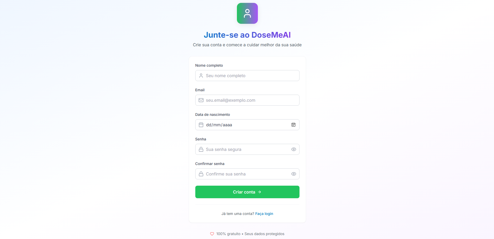
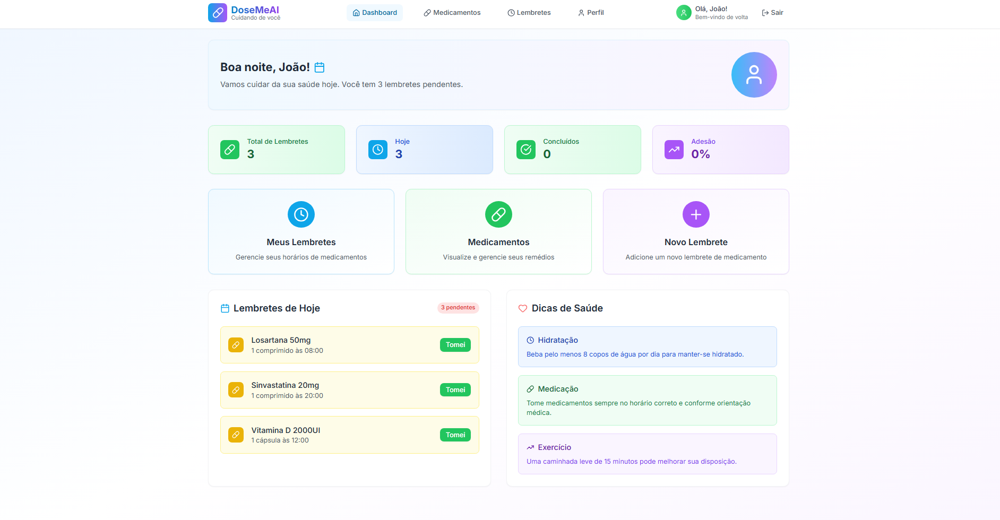
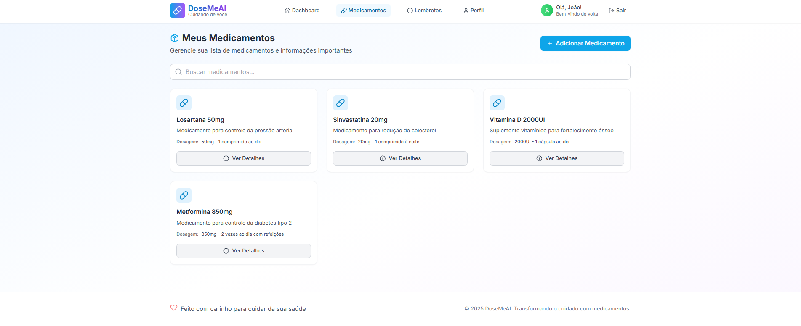
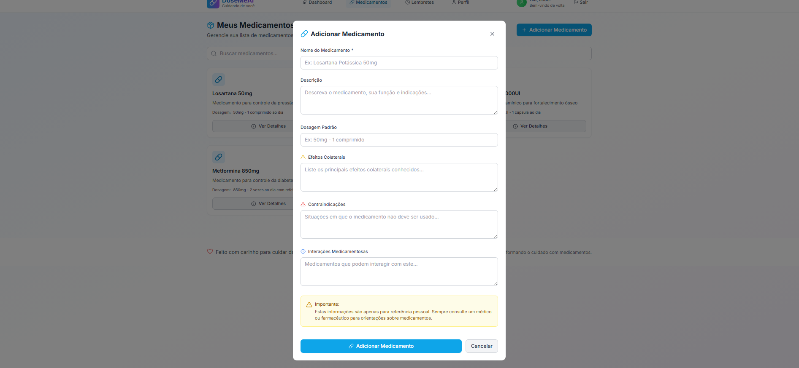
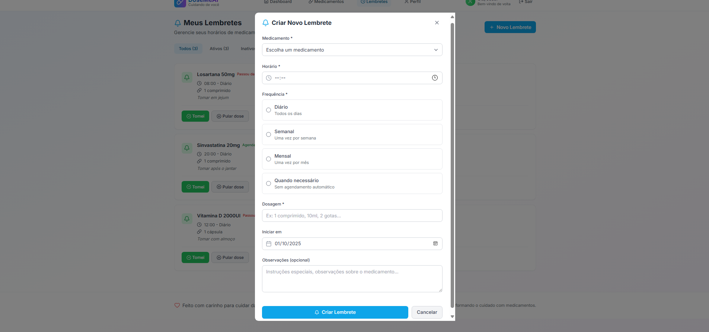
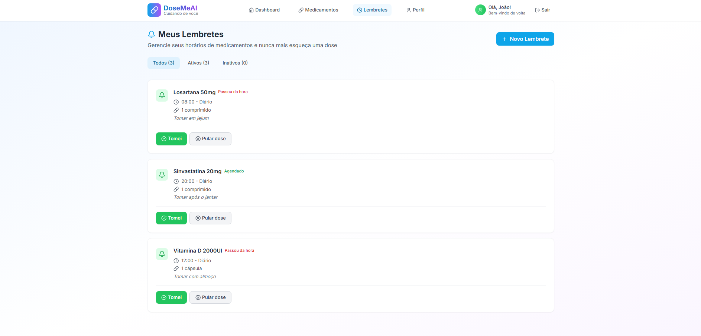
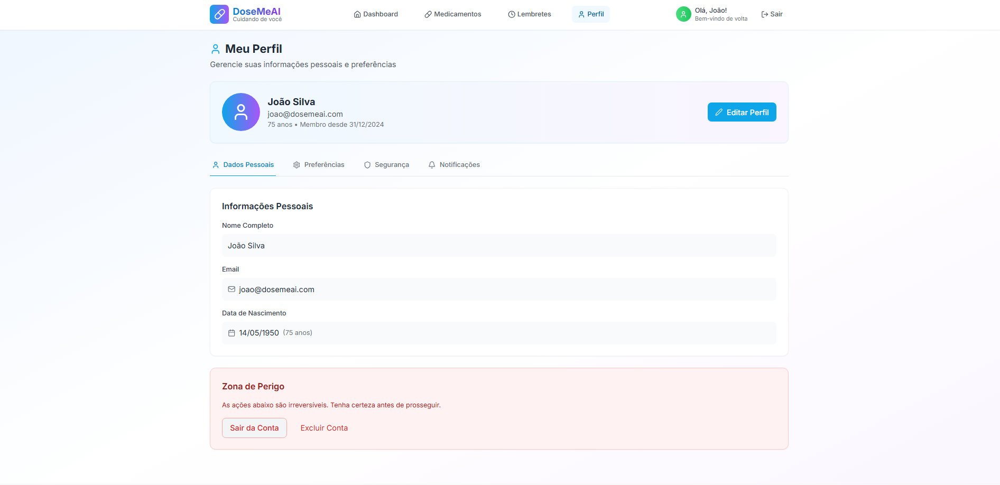
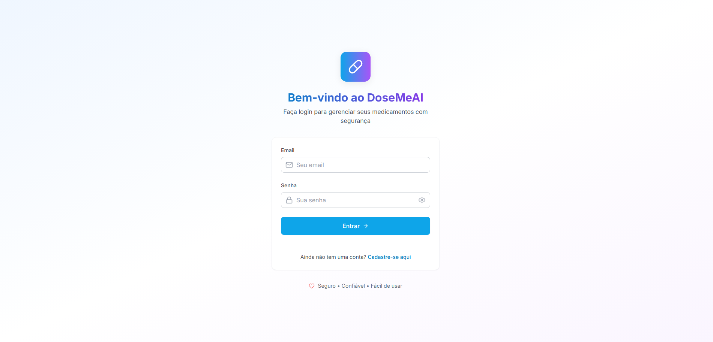

# 🧓💊 DoseMeAI


**DoseMeAI** é uma aplicação inteligente de gerenciamento de medicamentos desenvolvida para ajudar pessoas, especialmente idosos, a organizarem e lembrarem de tomar seus medicamentos de forma segura e eficiente.

## 📋 Índice

- [Sobre o Projeto](#-sobre-o-projeto)
- [Funcionalidades](#-funcionalidades)
- [Tecnologias Utilizadas](#-tecnologias-utilizadas)
- [Pré-requisitos](#-pré-requisitos)
- [Instalação e Execução](#-instalação-e-execução)
- [Configuração](#-configuração)
- [API Documentation](#-api-documentation)
- [Estrutura do Projeto](#-estrutura-do-projeto)
- [Uso da API](#-uso-da-api)
- [Testes](#-testes)
- [Deploy](#-deploy)
- [Contribuição](#-contribuição)
- [Licença](#-licença)

## 🎯 Sobre o Projeto

DoseMeAI foi desenvolvido com o objetivo de resolver um problema crítico no cuidado da saúde: o esquecimento e a má gestão de medicamentos, especialmente entre pessoas idosas. A aplicação oferece uma interface amigável e intuitiva para:

- **Cadastrar medicamentos** no sistema
- **Criar lembretes** personalizados
- **Acompanhar** a adesão ao tratamento
- **Garantir segurança** no uso de medicamentos

### 🎨 Identidade Visual

A aplicação utiliza uma identidade visual acolhedora e acessível:
- **Personagem Principal**: Idoso simpático e confiável
- **Paleta de Cores**: Tons pastéis suaves (azul claro, verde menta, roxo suave)
- **Elementos**: Ícones de relógio, check marks, corações
- **Filosofia**: Design inclusivo e amigável para todas as idades

## ✨ Funcionalidades

### 🔐 Sistema de Autenticação
- ✅ Registro de usuários com validação completa
- ✅ Login seguro com autenticação JWT
- ✅ Proteção de rotas sensíveis
- ✅ Gerenciamento de sessões

### 💊 Gerenciamento de Medicamentos
- ✅ Cadastro completo de medicamentos
- ✅ Busca inteligente por nome
- ✅ Listagem organizada de medicamentos
- ✅ Informações detalhadas sobre cada medicamento

## Prints do Frontend
Abaixo, prints da interface web para facilitar a apresentação e geração de slides:

| Tela 1 | Tela 2 |
| ------ | ------ |
|  |  |
|  |  |
|  |  |
|  |  |

- ✅ Criação de lembretes personalizados
- ✅ Configuração de horários múltiplos
- ✅ Notificações por email (integração Resend)
- ✅ Histórico de lembretes

### 📊 Dashboard e Relatórios
- ✅ Visualização de lembretes pessoais
- ✅ Acompanhamento de adesão
- ✅ Histórico de medicamentos

## 🛠 Tecnologias Utilizadas

### Backend
- **Java 17** - Linguagem de programação
- **Spring Boot 3.5.6** - Framework principal
- **Spring Security** - Segurança e autenticação
- **Spring Data JPA** - Persistência de dados
- **JWT (JSON Web Token)** - Autenticação stateless

- **MapStruct** - Mapeamento de objetos
- **Lombok** - Redução de código boilerplate

### Banco de Dados
- **PostgreSQL** - Banco de dados principal
- **Hibernate** - ORM (Object-Relational Mapping)

### Documentação e Testes
- **Swagger/OpenAPI 3** - Documentação interativa da API
- **Spring Boot Test** - Testes unitários e integração
- **Spring REST Docs** - Documentação de testes

### DevOps e Deploy
- **Docker** - Containerização
- **Docker Compose** - Orquestração de containers
- **Maven** - Gerenciamento de dependências

### Integrações
- **Resend** - Serviço de envio de emails

## 📋 Pré-requisitos

Antes de executar o projeto, certifique-se de ter instalado:

- **Java 17** ou superior
- **Maven 3.6** ou superior
- **Docker** e **Docker Compose**
- **PostgreSQL** (ou use o Docker Compose)
- **Git**

### Verificação das versões:
```bash
java -version
mvn -version
docker --version
docker-compose --version
```

## 🚀 Instalação e Execução

### 1. Clone o repositório
```bash
git clone <repository-url>
cd DoseMeAI
```

### 2. Configure as variáveis de ambiente
Crie um arquivo `.env` na raiz do projeto:
```env
# Database Configuration
POSTGRES_DB=dosemeai
POSTGRES_USER=dosemeai_user
POSTGRES_PASSWORD=dosemeai_password

# JWT Configuration
JWT_SECRET=minha-chave-secreta-muito-segura-para-jwt-tokens-deve-ter-pelo-menos-256-bits-de-comprimento
JWT_EXPIRATION=86400000

# Email Configuration (Resend)
RESEND_API_KEY=seu_resend_api_key_aqui
```

### 3. Execução com Docker (Recomendado)
```bash
# Inicia o banco de dados PostgreSQL
docker-compose up -d

# Executa a aplicação
mvn spring-boot:run
```

### 4. Execução Manual
Se preferir executar sem Docker:

```bash
# 1. Instale e configure o PostgreSQL local
# 2. Crie o banco de dados
createdb dosemeai

# 3. Execute a aplicação
mvn clean install
mvn spring-boot:run
```

### 5. Verificação
Acesse: `http://localhost:8081`

A aplicação estará disponível nas seguintes URLs:
- **API Base**: `http://localhost:8081/api`
- **Swagger UI**: `http://localhost:8081/swagger-ui.html`
- **API Docs**: `http://localhost:8081/v3/api-docs`

## ⚙️ Configuração

### Arquivo application.properties
```properties
# Database
spring.datasource.url=jdbc:postgresql://localhost:5432/${POSTGRES_DB}
spring.datasource.username=${POSTGRES_USER}
spring.datasource.password=${POSTGRES_PASSWORD}

# Server
server.port=8081

# JPA/Hibernate
spring.jpa.hibernate.ddl-auto=update
spring.jpa.show-sql=true

# JWT
jwt.secret=${JWT_SECRET}
jwt.expiration=${JWT_EXPIRATION}

# Email
resend.api.key=${RESEND_API_KEY}
```

### Profiles Disponíveis
- **default**: Desenvolvimento local
- **test**: Execução de testes
- **prod**: Produção (configuração adicional necessária)

## 📚 API Documentation

A documentação completa da API está disponível via Swagger UI em:
`http://localhost:8081/swagger-ui.html`

### Endpoints Principais

#### 🔐 Autenticação
```http
POST /api/auth/register    # Registrar usuário
POST /api/auth/login       # Fazer login
```

#### 💊 Medicamentos
```http
GET    /api/medicines           # Listar medicamentos
GET    /api/medicines/{name}    # Buscar medicamento
POST   /api/medicines           # Cadastrar medicamento
PUT    /api/medicines/{id}      # Atualizar medicamento
DELETE /api/medicines/{id}      # Deletar medicamento
```

#### ⏰ Lembretes
```http
GET    /api/reminders/my        # Listar meus lembretes
POST   /api/reminders           # Criar lembrete
PUT    /api/reminders/{id}      # Atualizar lembrete
DELETE /api/reminders/{id}      # Deletar lembrete
```

### Padrão de Resposta
Todas as respostas da API seguem o padrão:
```json
{
  "success": boolean,
  "message": "string",
  "data": object | array | null
}
```

### Autenticação
A API utiliza JWT Bearer Token:
```http
Authorization: Bearer <seu-jwt-token>
```

## 📁 Estrutura do Projeto

```
src/
├── main/
│   ├── java/com/dosemeai/DoseMeAI/
│   │   ├── config/              # Configurações (Security, Swagger, etc.)
│   │   ├── controllers/         # Controllers REST
│   │   │   ├── auth/           # Autenticação
│   │   │   ├── medicine/       # Medicamentos
│   │   │   └── reminder/       # Lembretes
│   │   ├── domain/             # DTOs e Models
│   │   │   ├── auth/           # DTOs de autenticação
│   │   │   ├── medicine/       # DTOs de medicamentos
│   │   │   ├── reminders/      # DTOs de lembretes
│   │   │   └── users/          # DTOs de usuários
│   │   ├── exceptions/         # Tratamento de exceções
│   │   ├── mappers/            # MapStruct mappers
│   │   ├── repositories/       # Repositories JPA
│   │   ├── security/           # Configurações de segurança
│   │   ├── services/           # Lógica de negócio
│   │   └── utils/              # Utilitários
│   └── resources/
│       ├── application.properties
│       └── static/             # Arquivos estáticos
└── test/                       # Testes unitários e integração
```

## 🔄 Uso da API

### Exemplo de Fluxo Completo

#### 1. Registrar usuário
```bash
curl -X POST http://localhost:8081/api/auth/register \
  -H "Content-Type: application/json" \
  -d '{
    "name": "João Silva",
    "email": "joao@email.com",
    "password": "senha123",
    "birthDate": "1950-05-15"
  }'
```

#### 2. Fazer login
```bash
curl -X POST http://localhost:8081/api/auth/login \
  -H "Content-Type: application/json" \
  -d '{
    "email": "joao@email.com",
    "password": "senha123"
  }'
```

#### 3. Listar medicamentos (com token)
```bash
curl -X GET http://localhost:8081/api/medicines \
  -H "Authorization: Bearer <seu-jwt-token>"
```

#### 4. Criar lembrete
```bash
curl -X POST http://localhost:8081/api/reminders \
  -H "Authorization: Bearer <seu-jwt-token>" \
  -H "Content-Type: application/json" \
  -d '{
    "medicineId": "uuid-do-medicamento",
    "time": "08:00:00",
    "frequency": "DAILY",
    "dosage": "1 comprimido"
  }'
```

## 🧪 Testes

### Executar todos os testes
```bash
mvn test
```

### Executar testes específicos
```bash
# Testes de controllers
mvn test -Dtest=*Controller*

# Testes de services
mvn test -Dtest=*Service*

# Testes de repositories
mvn test -Dtest=*Repository*
```

### Coverage Report
```bash
mvn jacoco:report
```

## 🐳 Deploy

### Docker Build
```bash
# Build da imagem
docker build -t dosemeai:latest .

# Executar container
docker run -p 8081:8081 --env-file .env dosemeai:latest
```

### Docker Compose (Produção)
```yaml
version: '3.8'
services:
  app:
    build: .
    ports:
      - "8081:8081"
    environment:
      - SPRING_PROFILES_ACTIVE=prod
    depends_on:
      - postgres
    
  postgres:
    image: postgres:15
    environment:
      POSTGRES_DB: ${POSTGRES_DB}
      POSTGRES_USER: ${POSTGRES_USER}
      POSTGRES_PASSWORD: ${POSTGRES_PASSWORD}
    volumes:
      - postgres_data:/var/lib/postgresql/data
    
volumes:
  postgres_data:
```

## 🤝 Contribuição

Contribuições são bem-vindas! Para contribuir:

1. **Fork** o projeto
2. Crie uma **branch** para sua feature (`git checkout -b feature/AmazingFeature`)
3. **Commit** suas mudanças (`git commit -m 'Add some AmazingFeature'`)
4. **Push** para a branch (`git push origin feature/AmazingFeature`)
5. Abra um **Pull Request**

### Padrões de Código
- Use **Java 17** features quando apropriado
- Siga as convenções do **Spring Boot**
- Mantenha **cobertura de testes** > 80%
- Use **Lombok** para reduzir boilerplate
- Documente APIs com **Swagger annotations**

### Commit Messages
Use o padrão de commits convencionais:
```
feat: adiciona nova funcionalidade
fix: corrige bug
docs: atualiza documentação
style: mudanças de formatação
refactor: refatoração de código
test: adiciona ou corrige testes
chore: tarefas de manutenção
```

## 🐛 Troubleshooting

### Problemas Comuns

#### 1. Erro de conexão com banco de dados
```bash
# Verifique se o PostgreSQL está rodando
docker-compose ps

# Reinicie o banco de dados
docker-compose restart postgres
```

#### 2. Porta 8081 já em uso
```bash
# Verifique processos na porta
netstat -ano | findstr :8081

# Ou altere a porta no application.properties
server.port=8082
```

#### 3. JWT Token inválido
- Verifique se o token não expirou
- Confirme que está usando o header correto: `Authorization: Bearer <token>`

#### 4. Swagger não carrega
- Acesse: `http://localhost:8081/swagger-ui.html`
- Verifique se a aplicação está rodando na porta correta

## 📝 Licença

Este projeto está sob a licença MIT. Veja o arquivo [LICENSE](LICENSE) para mais detalhes.

## 📞 Contato e Suporte

- **Email**: [seu-email@exemplo.com]
- **Issues**: [GitHub Issues](link-para-issues)
- **Documentação**: [Wiki do Projeto](link-para-wiki)

## 🙏 Agradecimentos

- Comunidade Spring Boot
- Documentação do PostgreSQL
- Swagger/OpenAPI team
- Todos os contribuidores do projeto

---

## 📊 Status do Projeto


**DoseMeAI** - Transformando o cuidado com medicamentos através da tecnologia 💊❤️
